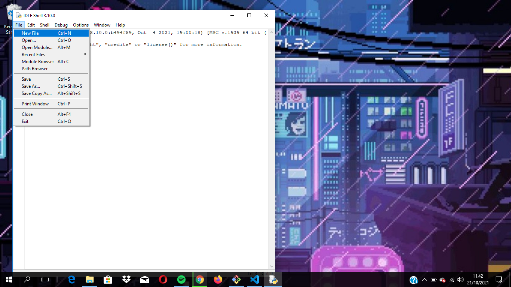

# Belajar-Python
## Belajar Input Menggunakan Python

1. Buka IDLE Python di pencarian (search)

2. Klik (File-New File)

3. Setelah itu Klik (File-Save)

4. Lalu pilih tempat untuk menyimpan file Pythonnya "JANGAN LUPA MENGGUNAKAN Format.py"

5. Coding bebas sesuai yang kalian mau

6. Setelah selesai coding, lalu pilih (Run-Run Module) untuk menjalankan program codingan

7. Output
